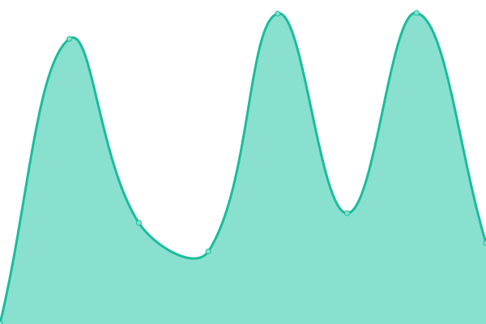

# [📈 Live Status](https://IntelliTect.github.io/EssentialCSharp.Status): <!--live status--> **🟩 All systems operational**

This repository contains the open-source uptime monitor and status page for [IntelliTect](https://intellitect.com/), powered by [Upptime](https://github.com/upptime/upptime).

With [Upptime](https://upptime.js.org), you can get your own unlimited and free uptime monitor and status page, powered entirely by a GitHub repository. We use [Issues](https://github.com/IntelliTect/EssentialCSharp.Status/issues) as incident reports, [Actions](https://github.com/IntelliTect/EssentialCSharp.Status/actions) as uptime monitors, and [Pages](https://IntelliTect.github.io/EssentialCSharp.Status) for the status page.

<!--start: status pages-->
<!-- This summary is generated by Upptime (https://github.com/upptime/upptime) -->
<!-- Do not edit this manually, your changes will be overwritten -->
<!-- prettier-ignore -->
| URL | Status | History | Response Time | Uptime |
| --- | ------ | ------- | ------------- | ------ |
|  [EssentialCSharp](https://essentialcsharp.com/) | 🟩 Up | [essential-c-sharp.yml](https://github.com/IntelliTect/EssentialCSharp.Status/commits/HEAD/history/essential-c-sharp.yml) | 

 548ms
     
 | 

<a href="https://IntelliTect.github.io/EssentialCSharp.Status/history/essential-c-sharp">100.00%</a>
    

|  [IntelliTect.com](https://intellitect.com/) | 🟩 Up | [intelli-tect-com.yml](https://github.com/IntelliTect/EssentialCSharp.Status/commits/HEAD/history/intelli-tect-com.yml) | 

 947ms
     
 | 

<a href="https://IntelliTect.github.io/EssentialCSharp.Status/history/intelli-tect-com">100.00%</a>
    

<!--end: status pages-->

[**Visit our status website →**](https://IntelliTect.github.io/EssentialCSharp.Status)

## 📄 License

- Powered by: [Upptime](https://github.com/upptime/upptime)
- Code: [MIT](./LICENSE) © [IntelliTect](https://intellitect.com/)
- Data in the `./history` directory: [Open Database License](https://opendatacommons.org/licenses/odbl/1-0/)
